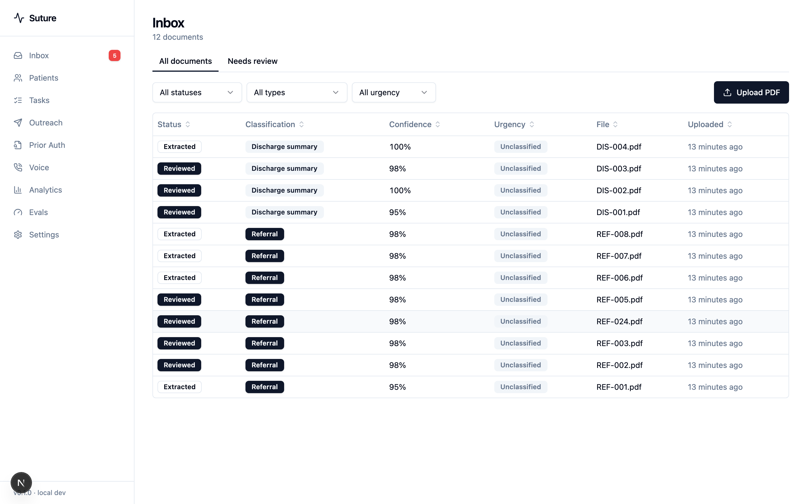
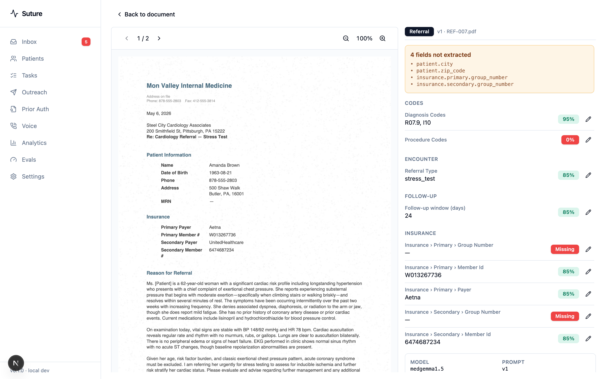
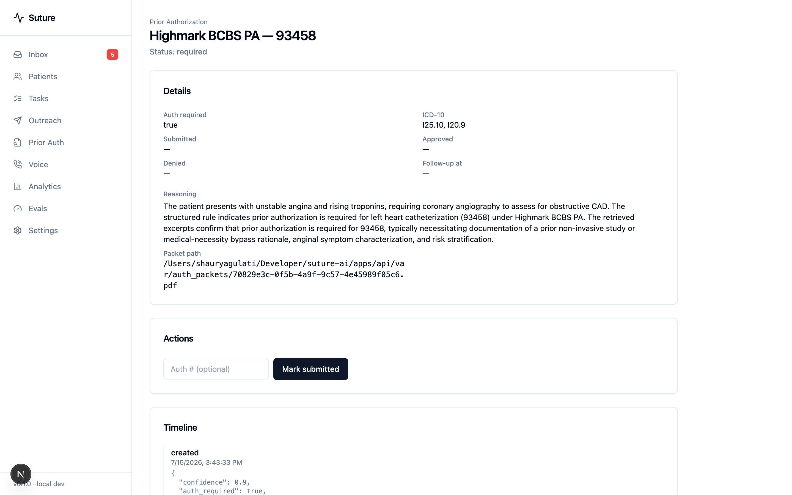
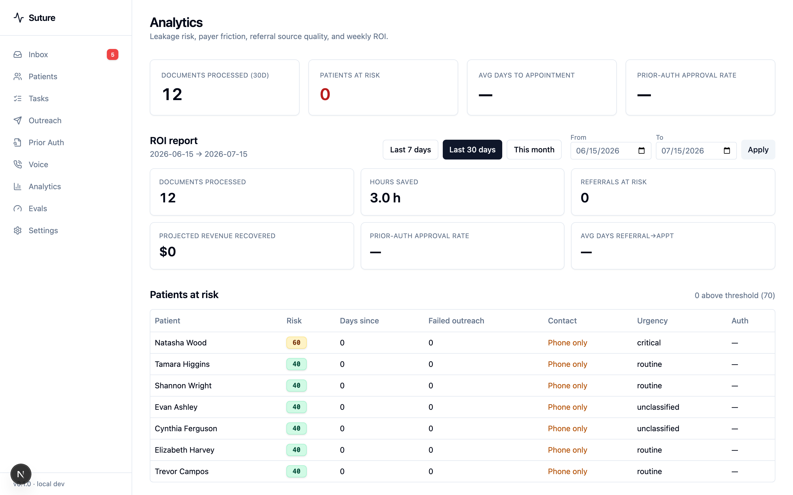

# Suture

**AI command center for cardiology practices.** Suture closes the loop from an inbound
referral or discharge fax all the way to a booked follow-up: **fax/PDF → OCR → AI
classification → AI field extraction → human review → workflow + SLA tasks → multi-channel
patient outreach → prior-auth packet → confirmation fax-back to the discharging hospital.**

Built solo for independent cardiology practices in the Western Pennsylvania / Pittsburgh
metro. The codebase is also a portfolio artifact demonstrating senior-level engineering
judgement on a HIPAA-class workload.

> ⚠️ **Local development only (v1).** The only paid dependency is the optional Claude API
> (BYOK). Everything else — Postgres, Redis, OCR, embeddings, the LLM, and voice STT/TTS —
> runs locally.

## Engineering highlights

- **Fail-closed multi-tenancy** enforced at the ORM layer (one SQLAlchemy event listener), not
  per-query — a missing tenant context raises rather than leaks, and cross-tenant reads return 404.
- **HIPAA-class data handling**: field-level Fernet encryption for PHI, an append-only audit trail
  that records column names + IDs but never PHI values, security headers + auth rate limiting.
- **Local-first AI with BYOK**: every LLM/embedding call goes through a provider interface
  (local Ollama by default, Claude/OpenAI opt-in) — no hard vendor dependency.
- **A real eval harness**: extraction accuracy is measured against a synthetic ground-truth corpus
  (per-field precision/recall/F1, exact-match, macro-F1) and recorded per run, so prompt/model
  changes are comparable over time.
- **End-to-end clinical workflow**: fax/PDF → OCR → AI extraction → human review → state machine →
  SLA tasks → multi-channel outreach → prior-auth RAG → confirmation fax-back → a LiveKit voice agent.
- **11 ADRs** documenting the load-bearing decisions (tenant guard, PHI encryption, auth, BYOK,
  inline vs. async extraction, deterministic confidence, voice/PSTN scope, tenant-isolation
  boundaries).

## What's built

Suture is a multi-tenant system with strict clinic isolation, field-level PHI encryption,
and an append-only audit trail. The major capabilities are in place:

| Area | Capability | Status |
|---|---|---|
| Inbox | Upload, OCR (Docling → pypdf fallback), AI classification, filtering, PDF viewer | ✅ |
| Extraction | AI field extraction with deterministic per-field confidence + an eval harness | ✅ |
| Review | Side-by-side PDF + fields, inline edit, approve → creates Patient/Referral/Discharge | ✅ |
| Workflow | Referral & discharge state machines, SLA-tracked task generation | ✅ |
| Outreach | Multi-channel cadence (SMS/email/voice), tokenized patient self-scheduling | ✅ |
| Prior auth | Payer-rules RAG (hybrid structured + vector), auth-required check, packet + appeals | ✅ |
| Analytics | Leakage, payer friction, referral quality, ROI dashboards | ✅ |
| Voice | Ember voice agent (LiveKit + Whisper STT + Piper TTS + LLM): one-click browser test caller, live transcript stream, encrypted call records | ✅ |

External delivery channels (fax, SMS, email, PSTN voice) run behind **local stub providers**
in v1 — the full pipeline executes and is auditable, but nothing leaves the machine. See
`docs/DECISIONS/` (ADR 010) for the rationale.

## Architecture (load-bearing patterns)

- **Multi-tenant isolation** — a SQLAlchemy `do_orm_execute` listener on `Session` injects a
  `with_loader_criteria(ClinicScopedBase, clinic_id == current_clinic_id)` clause into every
  statement touching a clinic-scoped model; the clinic id lives in a `ContextVar` set from the
  JWT. Missing context **fails closed**. Cross-tenant reads return 404, not 403. ADR 011
  records the as-built mechanism and its one known boundary.
- **PHI encryption** — `EncryptedString` (Fernet `TypeDecorator`) on `patients.dob/phone/ssn`
  and `insurance_policies.member_id`. App-layer, not pgcrypto (ADR 003).
- **Audit logging** — `after_insert/update/delete` listeners write to `audit_logs` for every
  PHI-bearing model; `details` holds **column names and IDs only, never PHI values**.
- **LLM/embeddings behind providers** — every call goes through `get_llm_provider()` /
  `get_embedding_provider()`. Default is local **Ollama** (`medgemma1.5` LLM, `bge-m3`
  embeddings, 1024-dim); **BYOK** Claude/OpenAI via env (ADR 007).
- **TIMESTAMPTZ everywhere**, Alembic migrations, conventional commits enforced by commitlint.

See [`CLAUDE.md`](./CLAUDE.md) and [`docs/DECISIONS/`](./docs/DECISIONS) for the full rules
and the ADRs behind each decision.

## Tech stack

| Layer | Choice |
|---|---|
| Frontend | Next.js 15 (App Router), TypeScript strict, Tailwind, shadcn/ui, TanStack Query/Table |
| Backend | FastAPI (Python 3.12), SQLAlchemy 2.0 async, asyncpg |
| Database | Postgres 16 + pgvector + pgcrypto + uuid-ossp |
| Auth | NextAuth Credentials → FastAPI JWT (HS256) |
| Queue | Celery + Redis |
| AI — LLM | Local Ollama (`medgemma1.5`) by default; BYOK Claude (Sonnet/Opus/Haiku) or OpenAI |
| AI — OCR | Docling (IBM), pypdf fallback |
| AI — Embeddings | Ollama `bge-m3` (1024-dim, local); pgvector RAG |
| Voice | LiveKit Agents + Whisper.cpp (STT) + Piper (TTS) + local LLM |
| Observability | structlog, OpenTelemetry → Jaeger, Prometheus + Grafana |

## Quickstart

```bash
# Toolchain (one-time): Node 22+ (.nvmrc), pnpm 10+, Python 3.12 (.python-version),
# uv 0.11+, Docker Desktop. Optional: Ollama with medgemma1.5 + bge-m3 pulled.

pnpm install                 # root + workspaces
cd apps/api && uv sync       # backend deps
cd ../..                     # back to repo root

make gen-phi-key             # PHI_ENCRYPTION_KEY → apps/api/.env  (one-time)
make gen-jwt-keys            # JWT_SECRET        → apps/api/.env  (one-time)

make infra-up                # Postgres + Redis (Docker)
make migrate                 # alembic upgrade head
make seed                    # 2 clinics, 6 users, patients, providers
make seed-documents          # drive real PDFs through the upload→extract→approve pipeline
make eval-extraction         # populate real extraction-accuracy metrics (Evals dashboard)

make dev                     # api on :8000, web on :3000

# Optional — voice agent (Ember), in separate terminals:
make voice-up                # LiveKit server (Docker)
make voice-agent             # Ember worker (Whisper/Piper models download on first run)
# then: /voice → "Start test call" → Connect → talk to Ember in the browser
```

Then sign in at <http://localhost:3000> with a seeded account:

```
admin@steel-city-cardiology.example.com  /  suture_dev_123
```

(Seeded clinics: Steel City Cardiology, Allegheny Valley Heart & Vascular. Each has
admin / reviewer / readonly users with the same dev password.)

## Evaluation

Every LLM-touching feature ships with an eval harness; results are recorded in the
`eval_runs` table so prompt/model changes are comparable over time. The extraction eval runs
the real pipeline over the synthetic ground-truth corpus:

```bash
make eval-extraction         # → per-field accuracy, precision/recall, exact-match, macro-F1
```

Latest extraction run (synthetic corpus, 50 documents): **0.669 exact-match, 0.736 macro-F1**
on a local `medgemma1.5` model — BYOK Claude Sonnet scores materially higher. See
[`docs/EVAL.md`](./docs/EVAL.md) for methodology and how to add cases.

## Screenshots

All four are the real app against the seeded synthetic corpus — no mockups.
[`docs/DEMO.md`](./docs/DEMO.md) walks the full loop screen by screen.

### Inbox — every inbound fax/PDF, classified with confidence



### Review — PDF beside extracted fields, each with a deterministic confidence badge

Badges are validator-derived, never the model's self-report (ADR 009): green = validator
passed, red = missing or failed. The banner lists exactly what the model didn't extract.



### Prior auth — grounded determination with the payer policy it cited

Hybrid RAG: structured `(payer, CPT)` rule → pgvector retrieval → LLM synthesis. The
structured rule is authoritative for `auth_required`; the model only writes the reasoning.
With an empty payer-rules KB the check refuses rather than guessing.



### Analytics — leakage, payer friction, referral quality, ROI



## How this was built

Solo, AI-assisted (Claude Code), under a deliberate process. Worth stating plainly because
the process is the reason the codebase holds together:

- **Plan → gate → verify → commit.** Every feature ships as a numbered gate with its own
  verification target (`make verify-gate-*`). A failing gate is a hard stop — no piling
  changes onto a red build. HIPAA-class failures (tenant attack-path, audit PHI-leak) are
  never "fix it later."
- **The eval harness came before the first design partner.** Extraction accuracy is a number
  I can reproduce and diff across prompt/model versions, not a claim — which is why the
  README quotes a mediocre 0.669 exact-match instead of a flattering one.
- **Decisions are written down, including the wrong ones.** 11 ADRs record what was chosen and
  what was rejected. ADR 011 exists because a security review found the as-built tenant guard
  didn't match ADR 002's description; ADR 009 was later amended when the confidence scorer was
  caught letting the model's `missing_fields` override a validator. Both corrections are in the
  record rather than quietly patched.
- **Guardrails are codified, not remembered.** `CLAUDE.md` carries the load-bearing rules and
  anti-patterns; `ai/skills/` holds repeatable procedures for migrations, audit checks, and evals.
- **The architecture and the trade-offs are mine.** AI wrote a lot of the lines; the decisions
  in `docs/DECISIONS/` — and the responsibility for them — aren't delegated.

Scope is honest by design: this is a **portfolio artifact and proof-of-thesis**, not a product
in production. It runs local-only against synthetic data, with no BAA and therefore no real PHI.
What's deliberately deferred — real inbound fax, live delivery channels, PSTN, hosted HIPAA
infra — is the genuinely hard 20%, and it's listed rather than hidden.

## Documentation

- [`CLAUDE.md`](./CLAUDE.md) — architectural rules + anti-patterns (loaded by every session)
- [`docs/ARCHITECTURE.md`](./docs/ARCHITECTURE.md)
- [`docs/SECURITY.md`](./docs/SECURITY.md) — HIPAA-class controls + what's deferred to v2
- [`docs/EVAL.md`](./docs/EVAL.md)
- [`docs/DEMO.md`](./docs/DEMO.md) — 5-minute walkthrough
- [`docs/DECISIONS/`](./docs/DECISIONS) — ADRs

## License

UNLICENSED — proprietary work-in-progress.
